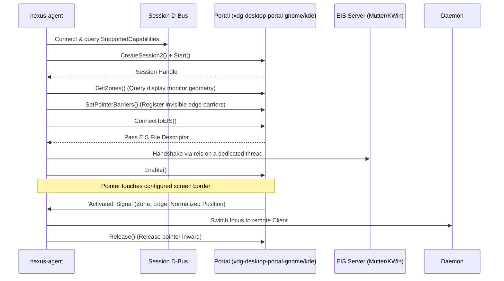

# Wayland, EIS & Desktop Input Portals

In modern Linux desktop environments powered by **Wayland** (such as GNOME 46+, KDE Plasma 6, and wlroots compositors), standard user-space applications cannot globally snoop or grab mouse pointer coordinates due to Wayland's strict security and isolation model.

NexusKVM overcomes this limitation by implementing the official **XDG Desktop Portal InputCapture** interface and the **EIS (Emulated Input Server)** protocol.

---

## 1. The `org.freedesktop.portal.InputCapture` Interface

NexusKVM natively implements version 2 of `InputCapture`, with an adaptive fallback to version 1:

---

## 2. Pointer Capture & Inward Release Flow

1. **Geometry Query (`GetZones`):** The session agent reads the spatial boundaries and scaling factors of all active physical monitors.
2. **Barrier Registration (`SetPointerBarriers`):** Invisible pointer barriers are placed precisely along the borders configured in `layout.json`.
3. **EIS Protocol Bridge (`reis`):** The pure-Rust `reis` library conducts the EIS handshake on a dedicated high-priority thread.
4. **Immediate Inward Release (`Release`):** When the cursor hits the barrier, the portal emits an `Activated` event. `nexus-agent` signals `nexus-kvmd` to route input to the client and immediately executes `Release` with an inward offset, preventing the desktop compositor from freezing.

---

## 3. GNOME 46+ Specifics & Soft-Suspend

### GNOME Mutter Barrier Re-registration Bug
In recent versions of GNOME (46+), invoking `Disable` and re-applying barriers during session switches can fail due to race conditions in Mutter's backend.

### NexusKVM Soft-Suspend Mitigation:
To guarantee stability, `nexus-agent` implements a **soft-suspend strategy**:
- The portal session remains permanently active.
- When the active target is not `local` (i.e. input is currently being sent to a remote PC), the agent simply ignores incoming `Activated` triggers without destroying or resetting the underlying D-Bus session.
