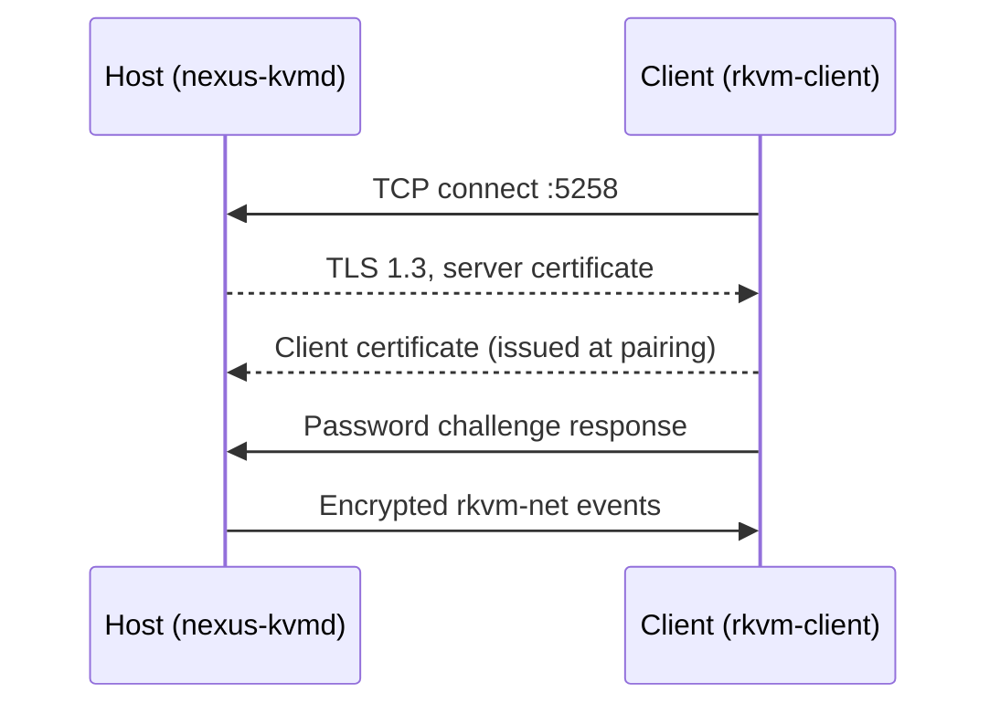

# Network, Firewall & Encryption

NexusKVM is built for a local LAN (Ethernet or Wi-Fi). Traffic uses **two planes** with different cryptography:

| Port | Plane | Protection | Carries |
| :--- | :--- | :--- | :--- |
| **`5258/tcp`** | Input (rkvm-net) | **TLS 1.3 + mTLS** (client cert issued at pairing) and a password challenge | Keyboard, mouse, and scroll events |
| **`5259/tcp`** | Agent control | **ChaCha20-Poly1305** (key derived with HKDF-SHA256 from the pairing password), timestamps, and replay rejection | `SwitchLocal`, clipboard text / PNG / files |

The host and client session agents both listen on `:5259`. Input injection on the client still goes through `rkvm-client` on `:5258`.

---

## 1. Firewall

If a software firewall is active, allow incoming TCP on **both** ports on every machine that should accept a peer.

### Ubuntu / Debian (`ufw`)

The `.deb` installer can configure `ufw`. Manual:

```bash
sudo ufw allow 5258/tcp comment 'NexusKVM input (TLS)'
sudo ufw allow 5259/tcp comment 'NexusKVM agent control (AEAD)'
sudo ufw reload
sudo ufw status verbose
```

### Fedora / RHEL / openSUSE (`firewalld`)

```bash
sudo firewall-cmd --permanent --add-port=5258/tcp
sudo firewall-cmd --permanent --add-port=5259/tcp
sudo firewall-cmd --reload
```

### nftables / iptables

```bash
sudo iptables -A INPUT -p tcp --dport 5258 -j ACCEPT
sudo iptables -A INPUT -p tcp --dport 5259 -j ACCEPT
sudo nft add rule inet filter input tcp dport { 5258, 5259 } accept
```

---

## 2. Input plane (`:5258`) — TLS 1.3 + mTLS



- Certificates are generated locally with OpenSSL (RSA 2048, host cert is a pairing CA).
- The copied invite JSON includes the CA certificate plus a **client cert and key**. After a protocol change that requires client certs, **re-pair** both machines.
- The GUI never sends keystrokes on this port; only the daemon / `rkvm-client` do.

---

## 3. Control plane (`:5259`) — AEAD

Agent-to-agent messages are JSON sealed with ChaCha20-Poly1305. Clipboard payloads (text, PNG, file trees) are sent as AEAD frames after a signed offer. Properties:

- Empty pairing password: the agent **refuses to listen**.
- Messages older than ~90 seconds, or with a reused nonce, are dropped.
- Limits: 2 MiB text, 16 MiB PNG, 64 MiB files; inbox pruned around 256 MiB.
- Symlinks are skipped; relative paths cannot contain `..`.

This is **not** TLS. Docs that previously labeled `:5259` as TLS 1.3 were wrong.

---

## 4. Local control socket (not a TCP port)

UI, agent, and `nexusctl` talk to `nexus-kvmd` over a **Unix socket** (`0660`):

- Session: `$XDG_RUNTIME_DIR/nexuskvm/control.sock`
- Boot/GDM host unit: `/run/nexuskvm/control.sock`

Every command must carry the pairing password as `token` (environment `NEXUSKVM_TOKEN` for `nexusctl`). The server also requires `SO_PEERCRED`. Remote shutdown over this socket is disabled.
