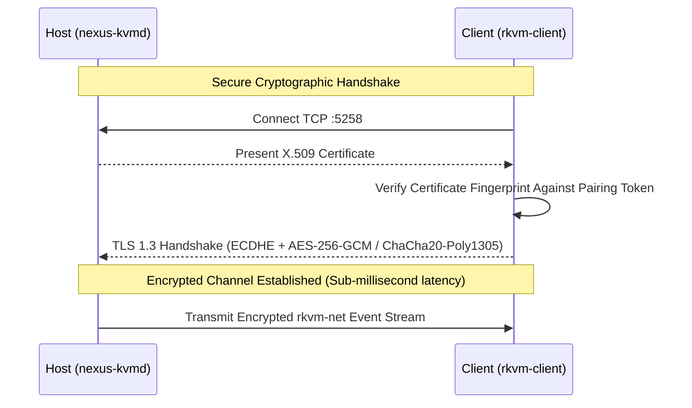

# Network, Firewall & TLS 1.3 Encryption

NexusKVM is engineered for high-speed local networks (Gigabit Ethernet or Wi-Fi). All traffic transmitted between the **Host** and **Clients** is strongly encrypted using **TLS 1.3** with automatically generated cryptographic certificates.

---

## 1. Network Ports Required

NexusKVM uses two distinct TCP ports:

| Port | Protocol | Traffic Type | Purpose |
| :--- | :--- | :--- | :--- |
| **`5258/tcp`** | TCP (TLS 1.3) | **Input Transport** | Ultra-low latency binary event stream (`rkvm-net`) for keyboard, mouse, and scrolling actions. |
| **`5259/tcp`** | TCP (TLS 1.3) | **Control & Clipboard** | Plaintext clipboard synchronization, topology metadata, and status RPCs. |

---

## 2. Linux Firewall Configuration

If a software firewall is active on the **Host** or **Clients**, you must permit incoming connections on both ports.

### A. Ubuntu / Debian (`ufw`)

The `.deb` installer configures `ufw` automatically. To verify or configure manually:

```bash
# Allow the KVM input stream
sudo ufw allow 5258/tcp comment 'NexusKVM peer connections'

# Allow the control and clipboard channel
sudo ufw allow 5259/tcp comment 'NexusKVM clipboard/control'

# Reload rules
sudo ufw reload
```

Verify firewall status:
```bash
sudo ufw status verbose
```

---

### B. Fedora / RHEL / openSUSE (`firewalld`)

```bash
# Add ports to the default/active zone
sudo firewall-cmd --permanent --add-port=5258/tcp
sudo firewall-cmd --permanent --add-port=5259/tcp

# Reload firewalld
sudo firewall-cmd --reload
```

---

### C. Manual Rules via `nftables` / `iptables`

```bash
# iptables
sudo iptables -A INPUT -p tcp --dport 5258 -j ACCEPT
sudo iptables -A INPUT -p tcp --dport 5259 -j ACCEPT

# nftables
sudo nft add rule inet filter input tcp dport { 5258, 5259 } accept
```

---

## 3. TLS 1.3 Cryptographic Negotiation

All keystrokes and clipboard data sent across the network are protected with **TLS 1.3**:



### Security Properties:
1. **Local Key Generation via OpenSSL:** Standard X.509 certificates and elliptic curve keys are generated locally on your machine without third-party cloud dependencies.
2. **Fingerprint Pinning:** The pairing code includes the SHA-256 fingerprint of the Host's certificate, preventing Man-in-the-Middle (MITM) attacks on untrusted local networks.
3. **Local Network Isolation:** NexusKVM communicates purely over local network interfaces without opening external ports on your Internet gateway.
