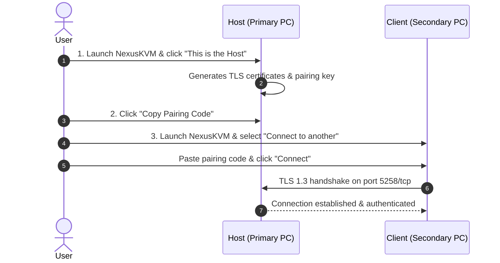

# Getting Started with NexusKVM

Welcome to the official documentation for **NexusKVM**, a modern, ultra-fast, and secure software KVM (*Keyboard, Video, Mouse* — specifically keyboard and mouse sharing) solution built for Linux.

---

## What is NexusKVM?

NexusKVM allows you to use a **single physical keyboard and mouse** connected to your primary computer (**Host**) to seamlessly control one or more secondary computers (**Clients**) over your local network (LAN or Wi-Fi).

Unlike legacy or heavy alternatives, NexusKVM is built from the ground up in **Rust**, with an encrypted network transport derived from **rkvm 0.6.1**, native **Wayland** support (via the *XDG Desktop InputCapture portal* and *libei*), and a fluid, lightweight user interface crafted with **Tauri 2 + React**.

---

## Fundamental Concepts

NexusKVM defines two primary roles:

| Role | Description | Running Process |
| :--- | :--- | :--- |
| **HOST (Server)** | The workstation with physical input hardware (keyboard and mouse). It captures hardware events and routes them to the active client. | `nexus-kvmd` (daemon) + `nexus-agent` (edge capture) + UI |
| **CLIENT (Target)** | The remote machine whose screen you want to control. It receives encrypted input events and injects them via a virtual keyboard and mouse. | `rkvm-client` (virtual input runtime `/dev/uinput`) + UI |

---

## Quick Setup Workflow (From the App)

Setting up NexusKVM takes three simple steps:

### Step 1: Configure the Host
1. Open NexusKVM on the machine with your physical keyboard and mouse.
2. Click **This is the Host**.
3. The application will automatically generate self-signed TLS X.509 certificates and start listening for peer connections.
4. Click **Copy pairing code**.

### Step 2: Configure the Client
1. Open NexusKVM on the secondary machine.
2. Select **Connect to another**.
3. Paste the code copied from the Host and click **Connect**.
4. Both machines are now securely paired and synchronized!

---

## Keyboard Shortcuts & Switching

To switch control between machines:

- **Default Host Hotkey:** <kbd>Left Alt</kbd> + <kbd>Left Ctrl</kbd>.
- **Edge Boundary Crossing:** Simply move your mouse cursor past the configured screen edge (e.g., the right border of your main monitor) to seamlessly jump into the client display.
- **Emergency Fail-Safe:** If the client computer goes to sleep, shuts down, or loses network connectivity, NexusKVM instantly detects the disconnection and **returns input focus to the local machine**, atomically releasing all held keys.

---

## System Tray Minimization

When closing the NexusKVM window, the application **does not terminate**; instead, it minimizes to the **System Tray** to keep the background daemon running without interrupting your workflow.

To exit completely, right-click the tray icon and select **Quit NexusKVM**.

---

## Next Steps

- [Installation & Packages](/guide/installation): Learn how to install `.deb`, `RPM`, or `AppImage` packages.
- [Linux Permissions & Security](/guide/permissions-and-security): Understand `/dev/uinput`, the `input` group, and `udev` rules.
- [Network & Firewall](/guide/firewall-and-network): Configure ports `5258/tcp` and `5259/tcp` in `ufw` and `firewalld`.
